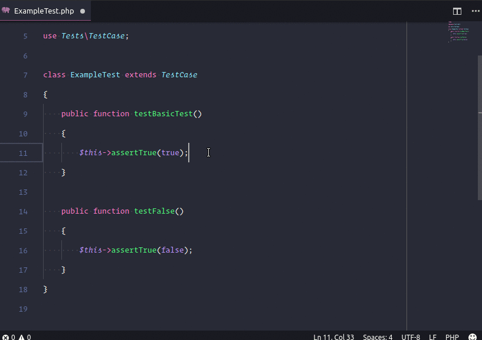
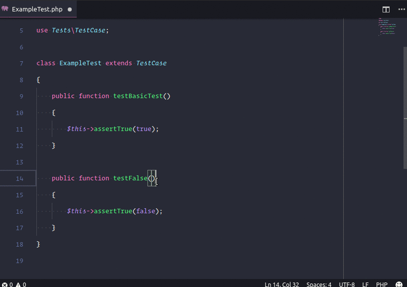
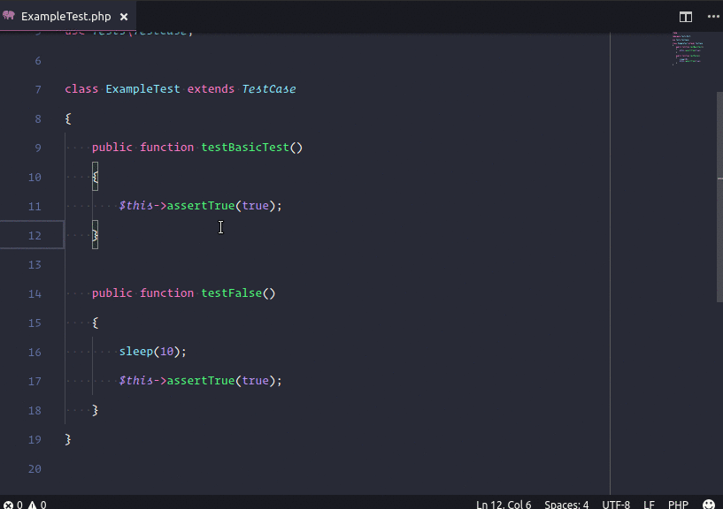
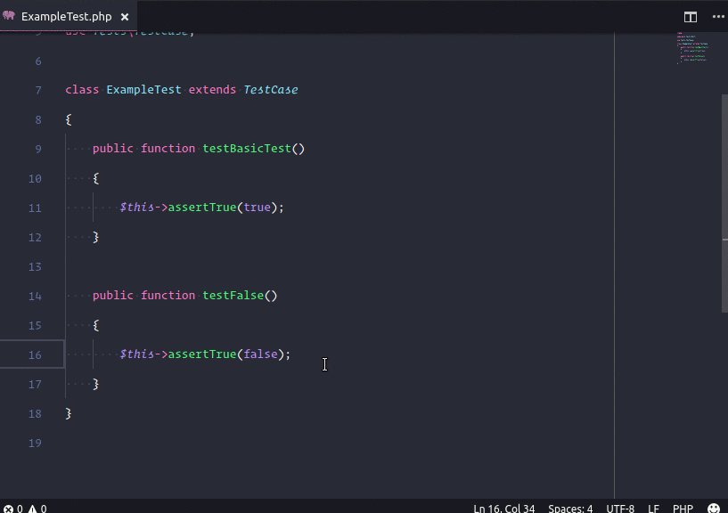
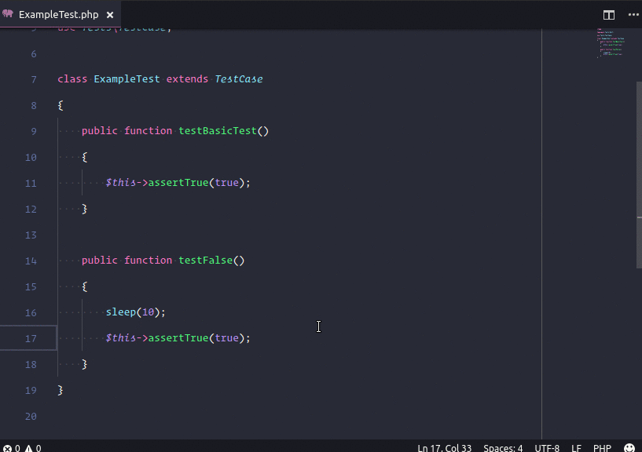

# PHPUnit Extended With Test Explorer for VSCode

<p align="center">
  <a href="https://marketplace.visualstudio.com/items?itemName=RobertOstermann.phpunit-extended-test-explorer"></a>
  <a href="https://marketplace.visualstudio.com/items?itemName=RobertOstermann.phpunit-extended-test-explorer"></a>
  <a href="https://marketplace.visualstudio.com/items?itemName=RobertOstermann.phpunit-extended-test-explorer"></a>
</p>

## Setup

- Install [phpunit](https://phpunit.de/) or have phpunit installed through composer.
- Set the config values:

```JSON
{
    "phpunit.execPath": "path/to/phpunit", // If this value is set to '' it will try to use the composer phpunit installation.
    "phpunit.args": [
        "--configuration", "./phpunit.xml.dist"
    ],
    "phpunit.envVars": {
        // Here you can define the environment variables to be set before executing phpunit
        "XDEBUG_CONFIG": "idekey=VSCODE"
    },
    "phpunit.excludedGroups": [
        // Groups to be excluded when running the TestSuiteWithExclusions command
    ],
    "phpunit.scriptsAfterTests": {
        "ok": [
            {
            "command": "some-command-with-args",
            "args": ["-status=ok"]
            },
            "another-command-without-args"
        ],
        "error": []
    },
    "phpunit.showOutput": "always", // always, error, ok
    "phpunit.fileRegex": "/.*(test|tests)\\w*\\.php",
    "phpunit.functionRegex": "/\\s*(public\\s+){0,1}function\\s+(\\w*test\\w*)\\s*\\(",
    "phpunit.folderPattern": "**/{test,tests,Test,Tests}/**/*.php",
    "phpunit.discoverAllTests": true
}
```

## How to use

Run with (`Cmd+Shift+P` on OSX or `Ctrl+Shift+P` on Windows and Linux) and execute:

- `PHPUnit Test Nearest`: This command will search the nearest function from the cursor position until the file's beginning.



- `PHPUnit Test Current File`: This command will test the current active file.



- `PHPUnit Test All Suite`: This command will run all the test suite.


- `PHPUnit Test All Suite With Exclusions`: This command will run the test suite without the excluded groups set in the configuration.

- `PHPUnit Test`: This command will show a window to pick the test to run.



- `PHPUnit Run Last Test`: This command will run the last test ran.



- `PHPUnit Cancel Current Test`: This command will cancel the current running test.



## Settings

| Name                        | Description                                                                                                   | Default                                                  |
| --------------------------- | ------------------------------------------------------------------------------------------------------------- | -------------------------------------------------------- |
| `phpunit.args`              | Any phpunit args (phpunit --help)                                                                             | `[]`                                                     |
| `phpunit.discoverAllTests`  | Determines whether to discover all tests immediately or discover them individually once opened in the editor. | `true`                                                   |
| `phpunit.envVars`           | Set environment variables before running phpunit                                                              | `{}`                                                     |
| `phpunit.excludedGroups`    | Groups to be excluded from the tests                                                                          | `[]`                                                     |
| `phpunit.execPath`          | Path to phpunit executable (if empty it tries to use composer installation).                                  | `""`                                                     |
| `phpunit.fileRegex`         | The regular expression used to determine test files.                                                          | `".\*(test(&#124;)tests)\\w\*\\.php"`                    |
| `phpunit.folderPattern`     | A file glob pattern used to determine the folders to watch. Only used when discoverAllTests is set to true.   | `"**/{test,tests,Test,Tests}/**/*.php"`                  |
| `phpunit.functionRegex`     | The regular expression used to determine the functions within a file to test.                                 | `\\s*(public\\s+){0,1}function\\s+(\\w*test\\w*)\\s*\\(` |
| `phpunit.scriptsAfterTests` | Scripts to execute after the tests run                                                                        | `{ "ok": [], "error": []}`                               |
| `phpunit.showOutput`        | Show the output console after the tests run (always, error, ok).                                              | `always`                                                 |

## Notes / Tips / Advanced

- **args** is recommended to set in your 'workspace settings'. You can add any phpunit args, check phpunit --help.
- To hook into the debugger ([github.com/felixfbecker/vscode-php-debug](https://github.com/felixfbecker/vscode-php-debug)). Add Key:`XDEBUG_CONFIG`, Value:`idekey=VSCODE` to your `phpunit.envVars` object.
- `fileRegex` is used to determine the files to add to the test explorer.
- `folderPattern` is only used when `discoverAllTests` is set to `true`.
- The file in the active editor is added based solely upon the `fileRegex`.

## Credits / Links

- [santigarcor](https://github.com/santigarcor/vscode-phpunit-extended)
- [VSCode's Extensions Samples](https://github.com/microsoft/vscode-extension-samples/tree/main/test-provider-sample)
- [VSCode's Testing Documentation](https://code.visualstudio.com/api/extension-guides/testing)

## License

The MIT License (MIT). Please see the [license file](LICENSE.md) for more information.
